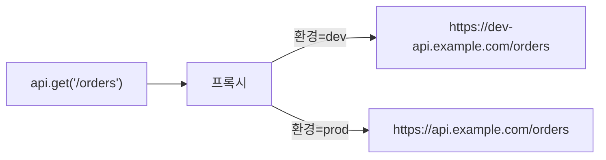

# API 환경 설정 (Dev / Prod)

외부 API 서버가 개발(dev)과 운영(prod) 환경으로 나뉘어 있을 때, 페이지 코드 변경 없이 환경을 전환할 수 있습니다.

## 동작 원리

페이지 코드에서 `api.get('/orders')`를 호출하면, AdminCraft 프록시가 현재 환경에 맞는 base URL을 선택하여 외부 API로 요청합니다.



페이지 코드는 상대 경로(`/orders`)만 사용하므로, 환경이 바뀌어도 코드를 수정할 필요가 없습니다.

## OAS3 서버 자동 감지

OAS3 스펙을 등록하면, `servers` 배열에서 서버 목록을 자동으로 파싱합니다.

```yaml
# OAS3 스펙 예시
servers:
  - url: https://dev-api.example.com
    description: Development server
  - url: https://api.example.com
    description: Production server
```

파싱 후 각 서버에 환경 라벨(dev, staging, prod 등)을 지정하고, 배포된 페이지에서 사용할 **기본 환경**을 선택합니다.

> **서버 환경 설정**
>
> | URL | 라벨 | 기본 |
> |-----|------|------|
> | `https://dev-api.example.com` | dev | |
> | `https://api.example.com` | prod | **●** |
>
> \* "기본"으로 설정된 환경이 배포된 페이지에서 사용됩니다

::: tip 서버가 1개뿐인 경우
`servers` 배열에 서버가 하나이거나 `servers` 자체가 없는 경우, 해당 URL이 자동으로 기본 환경(`default`)으로 설정되며 환경 분기 없이 동작합니다.
:::

## 에디터에서 환경 전환

에디터(미리보기) 상단에 환경 선택 드롭다운이 표시됩니다.

> **에디터 환경 토글**
>
> | 요소 | 설명 |
> |------|------|
> | 환경 드롭다운 | `[DEV ▾]` - 등록된 모든 환경을 전환 가능 |
> | 미리보기 | 선택한 환경의 실제 API 데이터로 렌더링 |

- 에디터에서는 dev, staging, prod 등 **모든 환경을 자유롭게 전환**할 수 있습니다
- 에디터 기본값은 `dev` (첫 번째 비-prod 환경)
- 환경을 전환해도 페이지 코드는 변경되지 않습니다

## 배포된 페이지의 환경

사이드바에서 클릭하여 접근하는 배포된 페이지는 관리자가 설정한 **기본 환경**(보통 prod)을 사용합니다.

| 모드 | 환경 선택 |
|------|----------|
| 에디터 미리보기 | 사용자가 드롭다운으로 자유롭게 전환 |
| 배포된 페이지 | 관리자가 설정한 기본 환경 (is_default) |

## 환경 관리

### 환경 추가/수정

**설정 > OAS3 스펙** 에서 스펙을 선택하면 서버 환경을 관리할 수 있습니다.

- OAS3 스펙을 다시 가져오면 `servers` 배열 변경 사항을 자동 감지
- 수동으로 환경을 추가/삭제 가능
- 라벨과 기본 환경 설정 변경 가능

### DB 스키마

| 컬럼 | 타입 | 설명 |
|------|------|------|
| id | TEXT PK | 환경 ID |
| spec_id | TEXT FK | OAS3 스펙 |
| label | TEXT | dev / staging / prod / 사용자 정의 |
| base_url | TEXT | 서버 URL |
| description | TEXT | 설명 |
| is_default | BOOLEAN | 배포 페이지 기본 환경 여부 |
