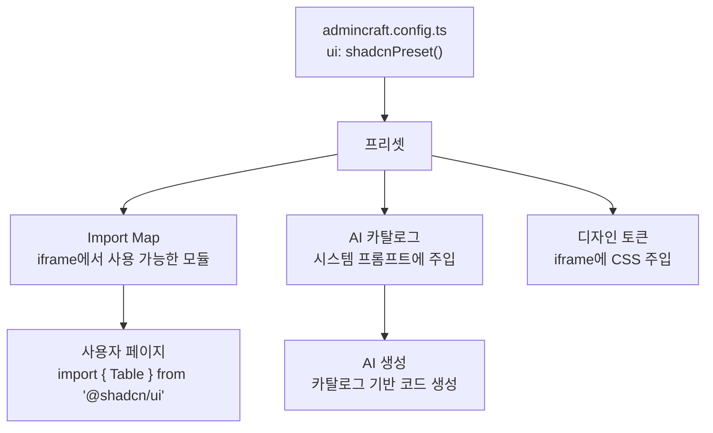

# 디자인 시스템 설정

AdminCraft는 **프리셋 기반**으로 UI 라이브러리를 설정합니다. 래퍼 레이어 없이, 설정된 디자인 라이브러리를 페이지에서 직접 사용합니다.

## 프리셋 선택

`admincraft.config.ts`에서 프리셋을 지정합니다.

```typescript
// shadcn/ui (기본값)
import { shadcnPreset } from '@admincraft/preset-shadcn'
export default defineConfig({ ui: shadcnPreset() })

// Ant Design
import { antdPreset } from '@admincraft/preset-antd'
export default defineConfig({ ui: antdPreset() })

// MUI (Material UI)
import { muiPreset } from '@admincraft/preset-mui'
export default defineConfig({ ui: muiPreset() })
```

## 기본 제공 프리셋

### shadcn/ui (`@admincraft/preset-shadcn`) - 기본값

| 특징 | 설명 |
|------|------|
| 경량 | 필요한 컴포넌트만 선택적 사용 (~50KB gzip) |
| Tailwind CSS | 유틸리티 기반 커스터마이징 |
| Radix UI 기반 | 접근성 우수 |
| 조합형 | 마크업 구조를 직접 조합하는 방식 |

주요 컴포넌트: `Table`, `Card`, `Dialog`, `Input`, `Select`, `Badge`, `Tabs`, `Button`, `Separator`

### Ant Design (`@admincraft/preset-antd`)

| 특징 | 설명 |
|------|------|
| 어드민 최적화 | Table, Form, Descriptions 등 어드민에 필요한 컴포넌트 기본 내장 |
| ProComponents | 고급 테이블/폼 확장 지원 |
| 글로벌 사용률 | React UI 라이브러리 중 가장 높은 사용률 |
| 번들 크기 | 중간 (~300KB gzip) |

주요 컴포넌트: `Table`, `Form`, `Input`, `Select`, `DatePicker`, `Descriptions`, `Card`, `Statistic`, `Modal`, `Tag`, `Badge`, `message`

### MUI (`@admincraft/preset-mui`)

| 특징 | 설명 |
|------|------|
| Material Design | 체계적인 디자인 시스템 |
| DataGrid | 고급 테이블 기능 기본 제공 |
| 테마 시스템 | createTheme로 강력한 커스터마이징 |
| 번들 크기 | 큰 편 (~400KB gzip) |

주요 컴포넌트: `DataGrid`, `TextField`, `Select`, `Autocomplete`, `Card`, `Typography`, `Dialog`, `Chip`, `Alert`, `Snackbar`

## 아키텍처



프리셋을 변경하면 Import Map, AI 카탈로그, 디자인 토큰이 모두 자동으로 전환됩니다.

## 커스텀 프리셋 (사내 디자인 라이브러리)

기본 프리셋이 맞지 않으면 직접 작성할 수 있습니다.

```typescript
// admincraft.config.ts
import { defineConfig } from '@admincraft/core'
import type { UIPreset } from '@admincraft/core'

const companyPreset: UIPreset = {
  // 1) iframe에서 사용 가능한 모듈
  importMap: {
    '@company/design-system': '/vendor/company-ds.esm.js',
  },

  // 2) AI가 참고할 컴포넌트 카탈로그
  catalog: [
    {
      name: 'DataTable',
      importStatement: "import { DataTable } from '@company/design-system'",
      props: '{ columns: Column[], data: any[], loading?: boolean }',
      description: '사내 표준 데이터 테이블',
    },
    // ...
  ],

  // 3) iframe에 주입되는 CSS (디자인 토큰)
  tokens: `
    :root {
      --company-primary: #0052cc;
      --company-bg: #ffffff;
    }
  `,
}

export default defineConfig({ ui: companyPreset })
```

### UIPreset 인터페이스

```typescript
interface UIPreset {
  importMap: Record<string, string>       // 모듈명 → 번들 경로
  catalog: ComponentCatalogEntry[]        // AI 컴포넌트 카탈로그
  tokens: string                          // CSS 변수 정의
}

interface ComponentCatalogEntry {
  name: string              // 컴포넌트명
  importStatement: string   // import 문
  props: string             // Props 시그니처
  description: string       // 용도 설명 (AI 참고)
  example?: string          // 사용 예시 코드
}
```

## 라이브러리 교체

라이브러리를 교체하면 **새로 생성되는 페이지**는 자동으로 새 라이브러리를 사용합니다. 기존 페이지는 AI를 활용하여 마이그레이션할 수 있습니다.

```
1. admincraft.config.ts에서 프리셋 변경
   ui: shadcnPreset()  →  ui: muiPreset()

2. 새 페이지 생성 시 자동으로 MUI 컴포넌트 사용

3. 기존 페이지 마이그레이션 (선택)
   → 에디터에서 "이 페이지를 MUI로 변환해줘" 프롬프트
   → AI가 코드를 새 라이브러리로 재생성
```

## 커스텀 컴포넌트에서 디자인 토큰 사용

프리셋 카탈로그에 없는 UI를 직접 만들 때, 디자인 토큰(CSS 변수)을 사용하면 기존 UI와 일관된 디자인을 유지할 수 있습니다.

```tsx
// shadcn/ui 프리셋의 토큰 활용 예시
<div style={{
  padding: 16,
  borderLeft: '2px solid hsl(var(--primary))',
  backgroundColor: 'hsl(var(--muted))',
}}>
  커스텀 영역
</div>
```
