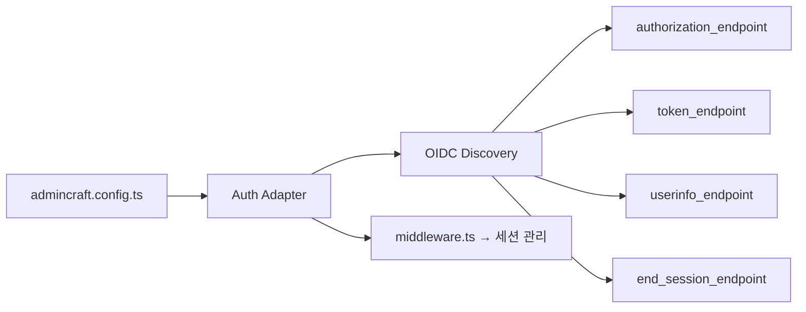
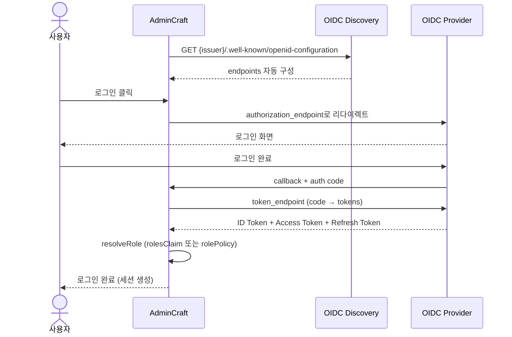

# 인증 설정 (OIDC)

AdminCraft는 **OpenID Connect(OIDC)** 표준으로 인증을 처리합니다. `issuer` URL 하나로 OIDC Discovery를 통해 모든 엔드포인트가 자동 구성됩니다.

## 아키텍처



## 역할 결정 방식

AdminCraft는 두 가지 방식으로 사용자 역할을 결정합니다.

| 방식 | 사용 시점 | 예시 |
|------|----------|------|
| `rolesClaim` + `roleMapping` | ID Token에 역할/그룹 claim이 있는 provider | Keycloak, 사내 IdP |
| `rolePolicy` | 역할 claim이 없는 provider | Google, GitHub 등 |

## Keycloak (rolesClaim 기반)

Keycloak은 ID Token에 `realm_access.roles` 또는 `groups` claim을 포함하므로, 이를 AdminCraft 역할로 매핑합니다.

```typescript
// admincraft.config.ts
import { defineConfig } from '@admincraft/core'
import { keycloakOidc } from '@admincraft/core/auth'

export default defineConfig({
  auth: keycloakOidc({
    serverUrl: 'https://keycloak.example.com',
    realm: 'my-company',
    clientId: process.env.OIDC_CLIENT_ID!,
    clientSecret: process.env.OIDC_CLIENT_SECRET!,
    roleMapping: {
      'realm-admin': 'admin',
      'admincraft-editor': 'editor',
      '*': 'viewer',
    },
  }),
})
```

내부적으로 다음이 자동 설정됩니다:
- `issuer`: `https://keycloak.example.com/realms/my-company`
- `rolesClaim`: `realm_access.roles`
- `scopes`: `['openid', 'profile', 'email', 'roles']`

### Keycloak groups 사용

Realm Roles 대신 Groups를 사용하려면 `rolesClaim`을 오버라이드합니다.

```typescript
export default defineConfig({
  auth: keycloakOidc({
    serverUrl: 'https://keycloak.example.com',
    realm: 'my-company',
    clientId: process.env.OIDC_CLIENT_ID!,
    clientSecret: process.env.OIDC_CLIENT_SECRET!,
    rolesClaim: 'groups',       // realm roles 대신 groups claim 사용
    roleMapping: {
      '/admincraft-admins': 'admin',
      '/admincraft-editors': 'editor',
      '*': 'viewer',
    },
  }),
})
```

### Keycloak 설정 가이드

1. Keycloak Admin Console에 접속
2. Realm 생성 또는 기존 Realm 선택
3. **Clients** > **Create Client**
   - Client ID: `admincraft`
   - Client Protocol: `openid-connect`
   - Access Type: `confidential`
4. **Valid Redirect URIs** 설정:
   ```
   http://localhost:3000/api/auth/callback
   ```
5. **Credentials** 탭에서 `Client Secret` 복사
6. **Realm Roles**에서 역할 정의:
   - `realm-admin` → AdminCraft admin
   - `admincraft-editor` → AdminCraft editor

::: tip 환경변수만으로 Keycloak 사용
```bash
OIDC_PROVIDER=keycloak
OIDC_CLIENT_ID=admincraft
OIDC_CLIENT_SECRET=your-secret
KEYCLOAK_SERVER_URL=https://keycloak.example.com
KEYCLOAK_REALM=my-company
```
환경변수 방식은 `rolePolicy`/`roleMapping` 설정이 불가하므로 모든 사용자가 `viewer`로 설정됩니다. 역할 관리가 필요하면 `config.ts`를 사용하세요.
:::

## 커스텀 OIDC — rolePolicy (역할 claim이 없는 provider)

Google, GitHub 등 ID Token에 역할 정보가 없는 provider는 `rolePolicy` 함수로 역할을 결정합니다.

### 이메일 도메인 기반

```typescript
import { defineConfig } from '@admincraft/core'
import { oidc } from '@admincraft/core/auth'

export default defineConfig({
  auth: oidc({
    issuer: 'https://accounts.google.com',
    clientId: process.env.OIDC_CLIENT_ID!,
    clientSecret: process.env.OIDC_CLIENT_SECRET!,
    rolePolicy: (user) => {
      if (user.email === 'cto@company.com') return 'admin'
      if (user.email.endsWith('@company.com')) return 'editor'
      return 'viewer'
    },
  }),
})
```

### 허용 목록 기반

```typescript
const ADMINS = ['admin@company.com']
const EDITORS = ['pm1@company.com', 'pm2@company.com', 'designer@company.com']

export default defineConfig({
  auth: oidc({
    issuer: 'https://accounts.google.com',
    clientId: process.env.OIDC_CLIENT_ID!,
    clientSecret: process.env.OIDC_CLIENT_SECRET!,
    rolePolicy: (user) => {
      if (ADMINS.includes(user.email)) return 'admin'
      if (EDITORS.includes(user.email)) return 'editor'
      return 'viewer'
    },
  }),
})
```

### 모든 사용자를 동일 역할로 (소규모 팀)

```typescript
export default defineConfig({
  auth: oidc({
    issuer: 'https://accounts.google.com',
    clientId: process.env.OIDC_CLIENT_ID!,
    clientSecret: process.env.OIDC_CLIENT_SECRET!,
    rolePolicy: () => 'editor',   // 모든 인증된 사용자 = editor
  }),
})
```

## 커스텀 OIDC — rolesClaim 기반 (사내 IdP)

roles/groups claim을 제공하는 사내 IdP는 Keycloak과 동일하게 `rolesClaim`으로 설정합니다.

```typescript
export default defineConfig({
  auth: oidc({
    issuer: 'https://idp.company.com',
    clientId: process.env.OIDC_CLIENT_ID!,
    clientSecret: process.env.OIDC_CLIENT_SECRET!,
    rolesClaim: 'groups',
    roleMapping: {
      'admin-group': 'admin',
      'dev-team': 'editor',
      '*': 'viewer',
    },
  }),
})
```

## 인증 흐름



## 역할

| 역할 | 접근 가능 영역 |
|------|---------------|
| **admin** | 모든 영역 + OAS3 스펙 관리 + 시스템 설정 |
| **editor** | 페이지 생성/수정/공유 + 갤러리 |
| **viewer** | 구독한 페이지 사용만 가능 |

### 역할 결정 우선순위

```
1. rolePolicy가 설정됨?   → rolePolicy(user) 호출
2. rolesClaim이 설정됨?   → ID Token에서 claim 추출 → roleMapping 적용
3. 둘 다 없음?            → 'viewer' (기본값)
```

여러 역할이 매핑되면 **가장 높은 권한**이 적용됩니다 (admin > editor > viewer).

## Token 관리

- **ID Token**: OIDC provider가 발급하는 JWT. 사용자 정보와 역할 claims 포함
- **Access Token**: 외부 API 호출 시 프록시를 통해 자동 주입
- **Refresh Token**: 만료 시 Auth Adapter가 자동 갱신
- **세션**: Next.js middleware에서 인증 상태 확인

## 로그아웃

OIDC Discovery의 `end_session_endpoint`를 활용하여 provider 세션도 함께 정리합니다.

- **Keycloak**: 서버 세션 로그아웃 → 로그인 화면으로 리다이렉트
- **기타 provider**: AdminCraft 세션만 삭제 (`end_session_endpoint`가 없는 경우)

## 커스텀 Auth Adapter

`AuthAdapter` 인터페이스를 직접 구현할 수도 있습니다. 자세한 인터페이스는 [AuthAdapter API 레퍼런스](/api/auth-adapter)를 참고하세요.
