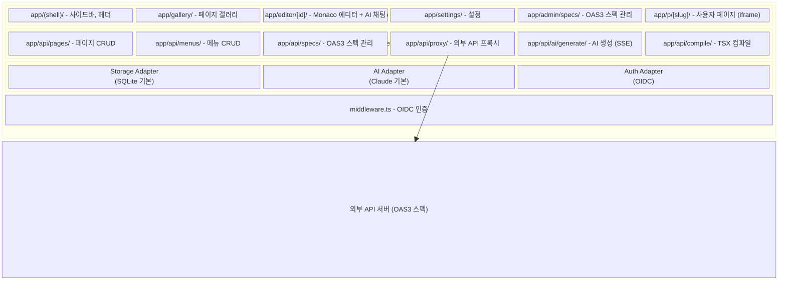
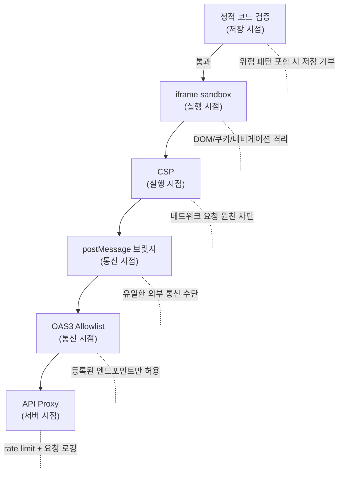
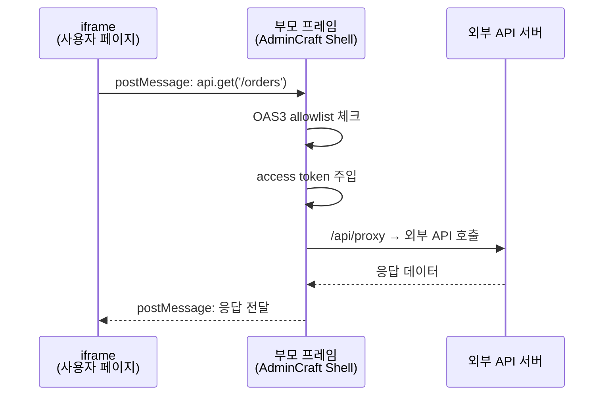
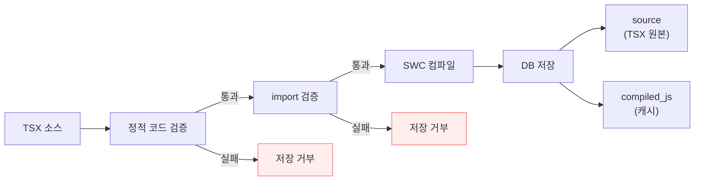
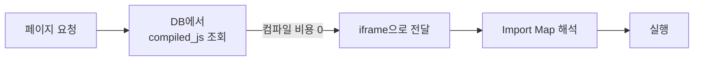
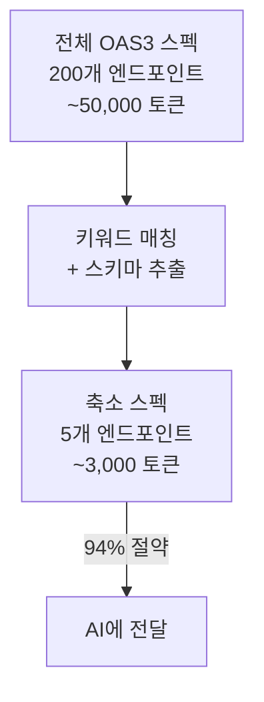
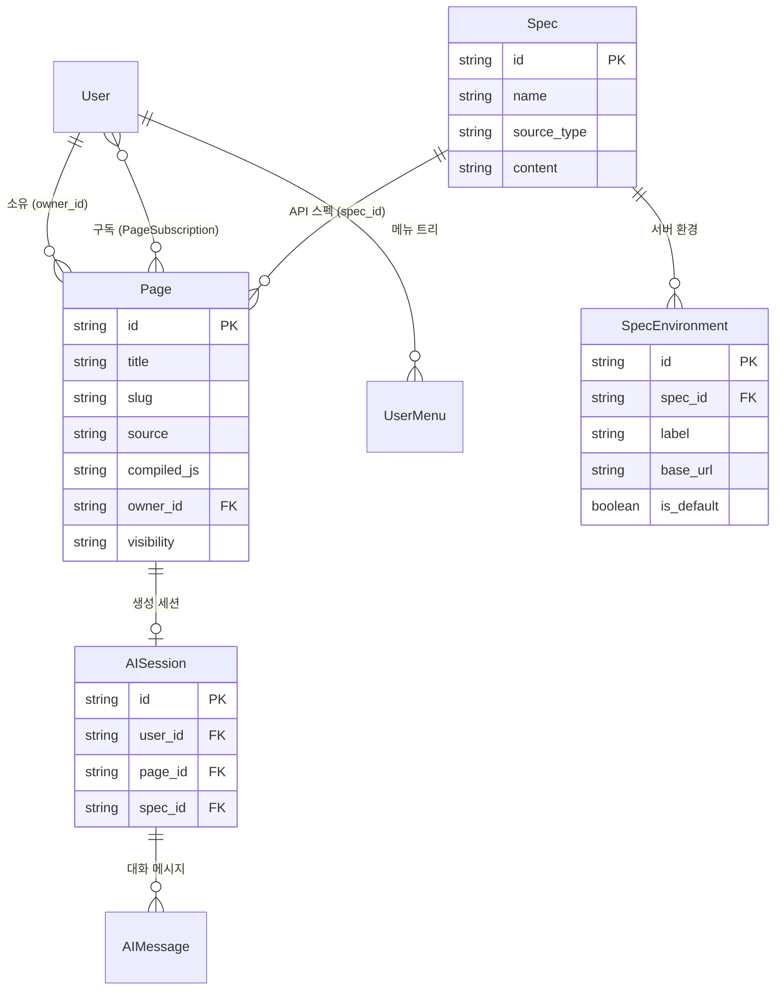

# 아키텍처

AdminCraft의 내부 아키텍처를 설명합니다.

## 전체 구조



## 핵심 원칙

- **Next.js 단일 구조**: UI(App Router)와 API(Route Handlers)가 하나의 프레임워크에서 동작
- **어댑터 패턴**: Storage, AI, Auth, 디자인 시스템 모두 교체 가능한 인터페이스로 추상화
- **iframe 샌드박스**: 사용자 페이지는 격리된 환경에서 실행
- **프록시 아키텍처**: 사용자 페이지의 외부 API 호출은 서버를 통해 중계

## 보안 아키텍처

6개 보안 레이어로 사용자 생성 코드를 보호합니다.



### iframe sandbox

```html
<iframe sandbox="allow-scripts">
  <!-- allow-same-origin ❌ 부모 DOM/쿠키 접근 차단 -->
  <!-- allow-forms       ❌ 폼 직접 제출 차단 -->
  <!-- allow-popups      ❌ 팝업/새 창 차단 -->
</iframe>
```

### CSP

```
Content-Security-Policy:
  default-src 'none';
  script-src  'unsafe-eval';
  style-src   'unsafe-inline';
  connect-src 'none';          ← 모든 네트워크 요청 차단
  img-src     data: blob:;
```

### postMessage 브릿지

사용자 페이지의 `useApi()` 훅은 내부적으로 `postMessage`를 사용하여 부모 프레임에 요청을 전달합니다. 부모 프레임은 OAS3 allowlist를 확인하고, access token을 주입하여 `/api/proxy`로 요청합니다. 이때 현재 환경(dev/prod)에 맞는 base URL이 자동으로 선택됩니다. ([API 환경 설정](/configuration/api-environments) 참고)



## TSX 컴파일 파이프라인

### 에디터 미리보기 (브라우저)

Sucrase로 브라우저에서 즉시 컴파일합니다. 보안 검증 없이 빠른 미리보기를 제공합니다.

### 저장 (서버)



### 페이지 로딩



## AI 통합

### 시스템 프롬프트 하네스 (3 레이어)

1. **Design Constraints**: 프리셋 카탈로그 컴포넌트 우선 사용, 불가능 시 디자인 토큰 기반 커스텀 HTML/CSS 허용
2. **Component Catalog**: 사용 가능한 컴포넌트와 props 시그니처
3. **Few-shot Templates**: 페이지 유형별 (목록, 상세, 폼, 대시보드) 표준 패턴

### 커스텀 컴포넌트 폴백

기존 컴포넌트로 구현 불가능한 요청 시 AI가 자동으로:
1. 사용자에게 커스텀 컴포넌트 생성을 알림
2. 디자인 토큰을 활용한 커스텀 컴포넌트 생성

### OAS3 토큰 절약

전체 스펙 대신 프롬프트 키워드와 관련된 엔드포인트/스키마만 추출하여 AI에 전달합니다.



### SSE 스트리밍

AI 응답은 Next.js Route Handler의 `ReadableStream`을 통해 SSE로 프론트엔드에 전달됩니다. 코드 생성 중 실시간 타이핑 효과를 제공합니다.

## 데이터 모델


