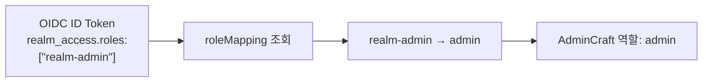

# 역할과 권한

AdminCraft는 세 가지 역할(`admin`, `editor`, `viewer`)로 사용자 접근을 제어합니다.

## 역할 개요

| 역할 | 대응 페르소나 | 설명 |
|:---:|---|---|
| `admin` | 시스템 관리자 | 시스템 전체 설정, 스펙 관리, 모든 페이지 관리 |
| `editor` | 기획자, 개발자 | 페이지 생성/편집/공개, AI 사용 |
| `viewer` | 운영자 | 공개된 페이지 구독 및 사용 |

## 권한 매트릭스

### 페이지

| 작업 | admin | editor | viewer |
|------|:---:|:---:|:---:|
| AI로 페이지 생성 | ✅ | ✅ | ❌ |
| 코드(TSX)로 페이지 작성 | ✅ | ✅ | ❌ |
| 본인 페이지 편집 | ✅ | ✅ | ❌ |
| 본인 페이지 삭제 | ✅ | ✅ | ❌ |
| 갤러리에 공개(publish) | ✅ | ✅ | ❌ |
| 타인 비공개 페이지 조회 | ✅ | ❌ | ❌ |
| 타인 페이지 편집 | ✅ | ❌ | ❌ |
| 타인 페이지 삭제 | ✅ | ❌ | ❌ |

### 갤러리

| 작업 | admin | editor | viewer |
|------|:---:|:---:|:---:|
| 공개 페이지 미리보기 | ✅ | ✅ | ✅ |
| 구독 (원본 참조) | ✅ | ✅ | ✅ |

### 메뉴

| 작업 | admin | editor | viewer |
|------|:---:|:---:|:---:|
| 자신의 메뉴 구성 | ✅ | ✅ | ✅ |

### OAS3 스펙

| 작업 | admin | editor | viewer |
|------|:---:|:---:|:---:|
| 등록 / 수정 / 삭제 | ✅ | ❌ | ❌ |
| 환경 설정 (dev/prod) | ✅ | ❌ | ❌ |
| 목록 조회 (페이지 생성 시) | ✅ | ✅ | ❌ |

### AI

| 작업 | admin | editor | viewer |
|------|:---:|:---:|:---:|
| AI 생성/수정 사용 | ✅ | ✅ | ❌ |
| 서버 AI 키 설정 | ✅ | ❌ | ❌ |

### 시스템

| 작업 | admin | editor | viewer |
|------|:---:|:---:|:---:|
| 시스템 설정 관리 | ✅ | ❌ | ❌ |

## 핵심 원칙

### viewer는 소비자

viewer는 페이지를 만들거나 수정할 수 없습니다. 갤러리에서 공개된 페이지를 **구독**하여 자신의 메뉴에 추가하고 사용하는 것이 주요 활동입니다.

::: tip 페이지 사용과 페이지 관리는 다릅니다
viewer도 구독한 페이지 내에서 **데이터 조회/수정(API 호출)은 정상 수행**할 수 있습니다. 예를 들어 주문 목록 페이지에서 주문을 검색하고, 주문 상태를 변경하는 것은 "페이지 사용"이지 "페이지 관리"가 아닙니다.
:::

### editor는 생산자

editor는 AI 또는 코드로 페이지를 만들고 갤러리에 공개할 수 있습니다. 단, 시스템 설정(OAS3 스펙 등록, 서버 AI 키)이나 타인 페이지 관리는 불가합니다.

### admin은 관리자

admin은 모든 권한을 보유합니다. 타인의 비공개 페이지를 조회/편집/삭제할 수 있으며, 이는 부적절한 콘텐츠 관리 등 관리 목적에 사용됩니다.

## 역할 결정 방식

역할은 OIDC 로그인 시 자동으로 결정됩니다. 설정 방법에 따라 두 가지 방식이 있습니다.

### 방법 1: rolesClaim (Keycloak 등)

ID Token에 포함된 역할 claim을 AdminCraft 역할로 매핑합니다.

```typescript
// admincraft.config.ts
import { keycloakOidc } from '@admincraft/core/auth'

export default defineConfig({
  auth: keycloakOidc({
    serverUrl: 'https://keycloak.example.com',
    realm: 'my-company',
    clientId: process.env.OIDC_CLIENT_ID!,
    clientSecret: process.env.OIDC_CLIENT_SECRET!,
    roleMapping: {
      'realm-admin': 'admin',
      'admincraft-editor': 'editor',
      '*': 'viewer',           // 매칭되지 않는 역할 → viewer
    },
  }),
})
```



### 방법 2: rolePolicy (커스텀 OIDC)

역할 claim이 없는 provider에서는 커스텀 함수로 역할을 결정합니다.

```typescript
// admincraft.config.ts
import { oidc } from '@admincraft/core/auth'

export default defineConfig({
  auth: oidc({
    issuer: 'https://accounts.google.com',
    clientId: process.env.OIDC_CLIENT_ID!,
    clientSecret: process.env.OIDC_CLIENT_SECRET!,
    rolePolicy: (user) => {
      if (user.email === 'cto@company.com') return 'admin'
      if (user.email.endsWith('@company.com')) return 'editor'
      return 'viewer'
    },
  }),
})
```

### 우선순위

```
1. rolePolicy 함수가 있으면 → rolePolicy(user) 결과 사용
2. rolesClaim + roleMapping이 있으면 → ID Token claim 기반 매핑
3. 둘 다 없으면 → 'viewer' (기본값)
```

자세한 인증 설정은 [인증 (OIDC)](/configuration/oauth) 문서를 참고하세요.
