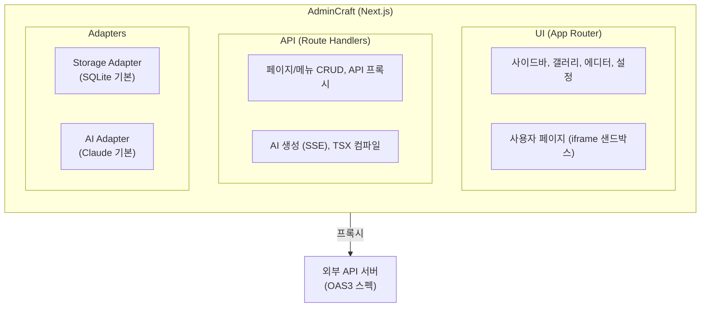

# AdminCraft란?

AdminCraft는 **AI 시대의 셀프서비스 어드민 프레임워크**입니다.

기존 어드민은 개발자가 모든 화면을 만들어야 했습니다. AdminCraft에서는 운영자, 기획자, 개발자 누구나 자기에게 필요한 어드민 페이지를 직접 만들 수 있습니다.

## 핵심 가치

### 셀프서비스

개발자에게 요청하지 않아도 됩니다. 자연어로 "주문 목록 페이지를 만들어줘"라고 말하면, AI가 페이지를 만들어줍니다. 원하는 대로 수정하고 저장하면 바로 사용할 수 있습니다.

### AI 생성

OAS3(OpenAPI 3.0) 스펙을 등록하면, AI가 해당 API를 활용하는 페이지를 자동 생성합니다. 테이블, 검색 폼, 상세 보기, 수정 폼 등 어드민에서 자주 쓰는 패턴을 AI가 알아서 구성합니다.

### 일관된 UI

AI가 만드는 모든 페이지는 시스템 프롬프트 하네스를 통해 일관된 디자인을 유지합니다. 프리셋에 설정된 UI 라이브러리 컴포넌트만 사용하도록 제한하여, 여러 사람이 만들어도 통일된 화면이 됩니다.

### 교체 가능한 설계

UI 라이브러리, 저장소, AI provider를 어댑터/프리셋 패턴으로 추상화했습니다. 기본 구성(shadcn/ui, SQLite, Claude)에서 시작해서, 필요에 따라 교체할 수 있습니다. 사내 디자인 라이브러리도 커스텀 프리셋으로 등록할 수 있습니다.

## 사용자 역할

| 역할 | 대표 페르소나 | 주요 활동 |
|:---:|---|---|
| **Admin** | 시스템 관리자 | 설치, 인증(OIDC) 설정, OAS3 스펙 등록, AI 설정 |
| **Editor** | 기획자, 개발자 | AI/코드로 페이지 생성, 갤러리 공유 |
| **Viewer** | 운영자 | 갤러리 구독, 데이터 조회·수정 |

각 역할의 상세 가이드는 [역할별 가이드](/guide/role-guides)를 참고하세요.

## 아키텍처 개요

AdminCraft는 **Next.js 단일 애플리케이션**으로 구성됩니다.

- 사용자의 비즈니스 API는 **별도 외부 서버**에 있습니다
- AdminCraft는 OAS3 스펙(JSON/YAML)을 통해 해당 API를 인식합니다
- 사용자 페이지의 API 호출은 AdminCraft가 **프록시**로 중계합니다

## 보안 모델

비개발자가 페이지를 만드는 환경이므로, 가장 엄격한 보안을 적용합니다.

- **iframe sandbox**: 사용자 페이지는 격리된 iframe에서 실행
- **CSP**: 모든 직접 네트워크 요청 차단 (`connect-src: 'none'`)
- **postMessage 브릿지**: API 호출은 부모 프레임이 대리 수행
- **OAS3 Allowlist**: 등록된 엔드포인트만 호출 가능
- **정적 코드 검증**: 위험 패턴 포함 시 저장 거부
- **Import Map 화이트리스트**: 허용된 모듈만 사용 가능

## 기술 스택

| 영역 | 기술 |
|------|------|
| 프레임워크 | Next.js (App Router) |
| 디자인 시스템 | shadcn/ui (교체 가능) |
| DB | better-sqlite3 (교체 가능) |
| AI | Claude API (교체 가능) |
| 코드 에디터 | Monaco Editor |
| TSX 컴파일 | Sucrase (브라우저) + SWC (서버) |
| 모노레포 | pnpm + Turborepo |
| 라이선스 | MIT |
